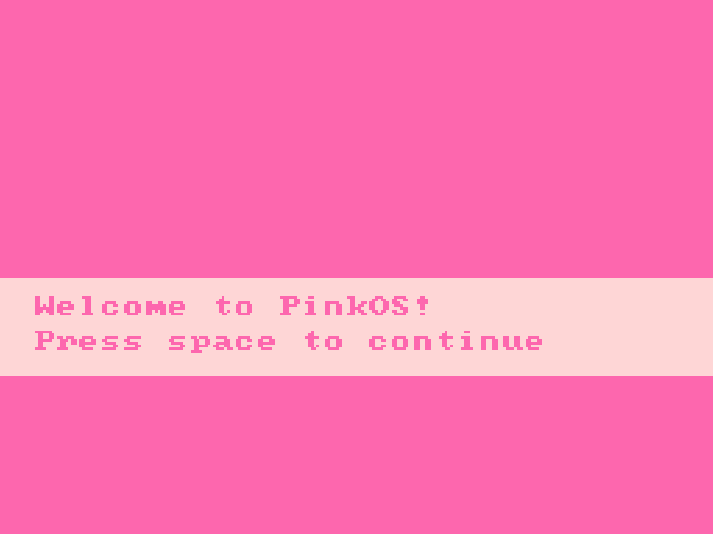
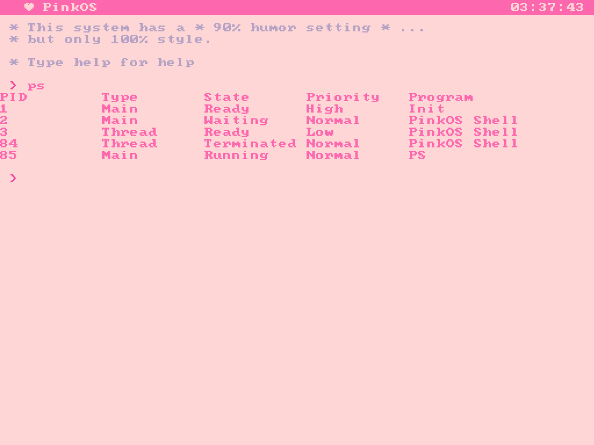
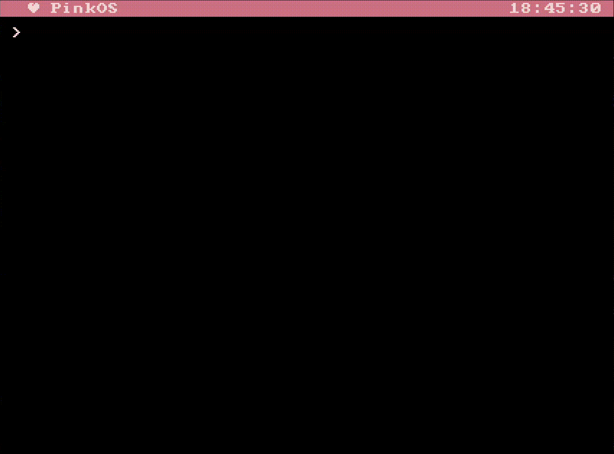
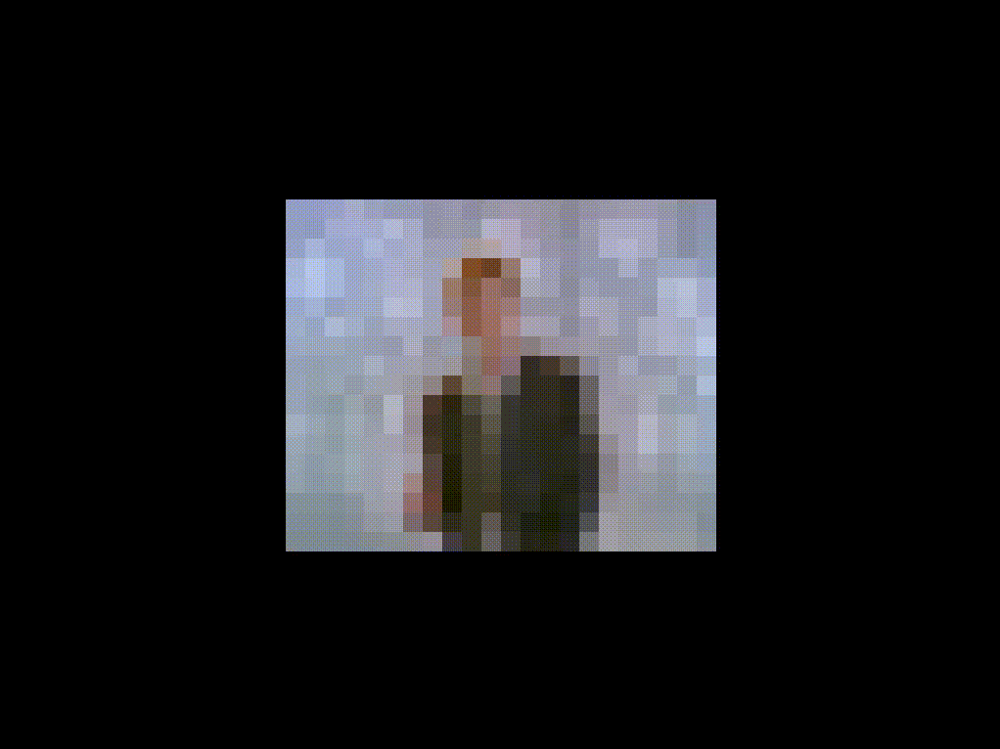

# PinkOS
> The final bOSs  🔥

PinkOS is a simple operating system written in C and assembly language. It is designed to be educational and to demonstrate basic operating system concepts. 
It includes a shell, basic file system commands, and a simple user interface.  
All the code was made in a modular and scalable way, which allows us to add new features in a very simple way.
So much so, that we support themes, fonts, font sizes, shortcuts, time zones, songs, images, connection to the outside world via serial, literally almost anything is easy to implement. As always, this once again highlights the importance of **good design**.

## Roadmap
As next milestones (cosistas are coming):
- Installing programs in runtimes by bringing the binary via serial (Successfull tests have been done).
- Complete overlay system (for mouse, alt+tab, etc...).
- More complete mouse support (now scrolling is supported but not clicking, dragging, etc...).
- Languages (I mean since we already have files we can do whatever we want)
- Events 2.0, the idea is to take the Event Manager to another level and support synchronous events and creating new events in runtime and offer event providers (it's all desinged, we just need to code it).
- With Events 2.0, it is super easy to implement a high level TRY CATCH. We would have custom exception types and everything would be super high level. Even with modals in case a process throws an execption without a try catch. Even allowing the process to register a handler to be able to terminate in a neat way like SIGINT in Linux (literally a: last words?!?!).

